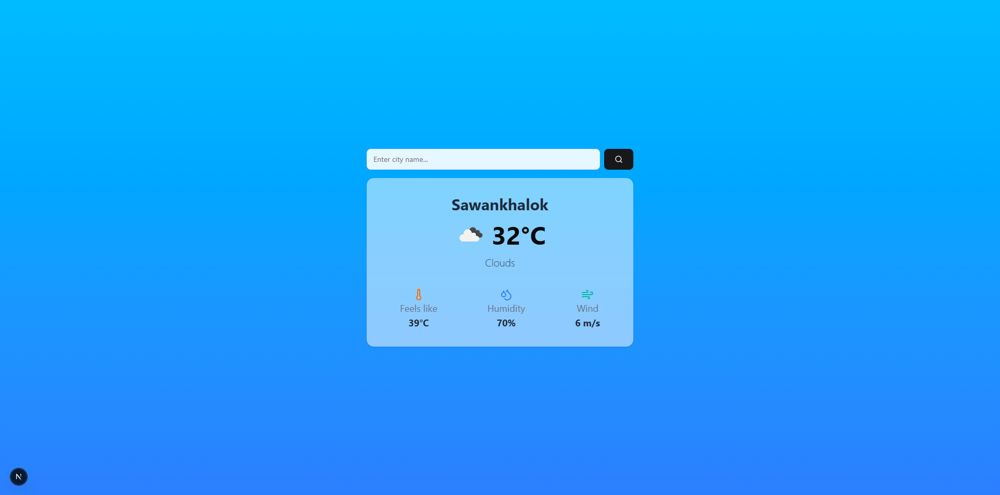

# 🌤️ Weather App

A modern, responsive weather application built with Next.js that provides real-time weather information for cities worldwide.

## ✨ Features

- 🔍 **City Search**: Search for weather information by city name
- 🌡️ **Real-time Data**: Current temperature, feels-like temperature, humidity, and wind speed
- 🎨 **Modern UI**: Beautiful gradient design with glassmorphism effects
- 📱 **Responsive**: Works perfectly on desktop, tablet, and mobile devices
- ⚡ **Fast Loading**: Built with Next.js for optimal performance
- 🛡️ **Error Handling**: Graceful error handling for invalid cities or API issues

## 🚀 Demo



## 🛠️ Tech Stack

- **Framework**: Next.js 15
- **UI Components**: shadcn/ui
- **Styling**: Tailwind CSS
- **Icons**: Lucide React
- **API**: OpenWeatherMap API
- **Language**: JavaScript

## 📦 Installation

1. **Clone the repository**
   ```bash
   git clone https://github.com/ShadowsDuck/nextjs-weather-app.git
   cd weather-app
   ```

2. **Install dependencies**
   ```bash
   npm install
   # or
   yarn install
   # or
   pnpm install
   ```

3. **Set up environment variables**
   
   Create a `.env` file in the root directory:
   ```env
   OPENWEATHER_API_KEY=your_api_key_here
   ```
   
   Get your API key from [OpenWeatherMap](https://openweathermap.org/api)

4. **Run the development server**
   ```bash
   npm run dev
   # or
   yarn dev
   # or
   pnpm dev
   ```

5. **Open your browser**
   
   Navigate to [http://localhost:3000](http://localhost:3000)

## 🔧 Configuration

### Environment Variables

| Variable | Description | Required |
|----------|-------------|----------|
| `OPENWEATHER_API_KEY` | Your OpenWeatherMap API key | Yes |

### API Setup

1. Sign up at [OpenWeatherMap](https://openweathermap.org/api)
2. Get your free API key
3. Add the API key to your `.env` file

## 🎯 Usage

1. Enter a city name in the search input
2. Click the search button or press Enter
3. View the current weather information including:
   - Current temperature
   - Weather condition with icon
   - Feels-like temperature
   - Humidity percentage
   - Wind speed

## 🙏 Acknowledgments

- [OpenWeatherMap](https://openweathermap.org/) for providing the weather API
- [shadcn/ui](https://ui.shadcn.com/) for the beautiful UI components
- [Lucide](https://lucide.dev/) for the icons
- [Tailwind CSS](https://tailwindcss.com/) for the styling system
